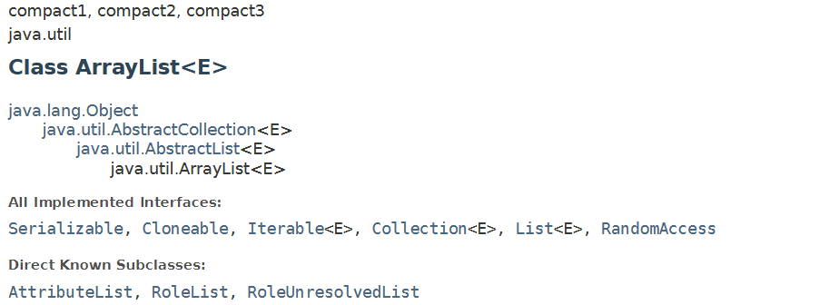

# ✏️ArrayList
## 📜API

공식 문서 : [ArrayList (Java Platform SE 8)](https://docs.oracle.com/javase/8/docs/api/java/util/ArrayList.html)

All Implemented interfaces를 살펴보면, `ArrayList`는 `List<E>`, `Collection<E>`, `Iterable<E>` 같은 여러 인터페이스를 구현(implements) 했다.
즉, `ArrayList`는 `List`의 기능을 그대로 사용할 수 있고, `List` 타입으로 다룰 수도 있다.

 

## 1️⃣ArrayList의 특징
참고 글 : [자바 ArrayList 구조 & 사용법 정리](https://inpa.tistory.com/entry/JAVA-%E2%98%95-ArrayList-%EA%B5%AC%EC%A1%B0-%EC%82%AC%EC%9A%A9%EB%B2%95)
- 연속적인(중간에 빈 공간이 없는) 데이터의 리스트
- 내부적으로 Object[]배열을 이용하여 요소를 저장
- 인덱스를 이용해 요소에 빠르게 접근할 수 있다
- 가변적으로 공간을 늘리거나 줄인다
- 배열 공간이 꽉 찰 때마다 배열을 copy하는 방식으로 늘리므로 이 과정에서 지연이 발생한다
- 데이터를 리스트 중간에 삽입/삭제할 경우 중간에 빈 공간이 생기지 않도록 요소들을 앞뒤로 이동시키기 때문에 삽입/삭제가 느리다
- 따라서 배열을 수정보다는 조회를 많이 하는 경우에 사용하는 것이 이득이다

 

## 2️⃣ArrayList vs Array(배열)

### 배열
- 정적할당 : 크기 변경 불가
- 메모리에 연속적으로 할당
- element를 삭제하더라도 해당 index는 빈 공간으로 남는다

### ArrayList 장단점
- 동적할당 : 크기 변경 가능
- 메모리에 연속적으로 나열되어 있지 않고 주소로 연결되어 있다
- element 사이에 빈 공간을 허용하지 않는다
