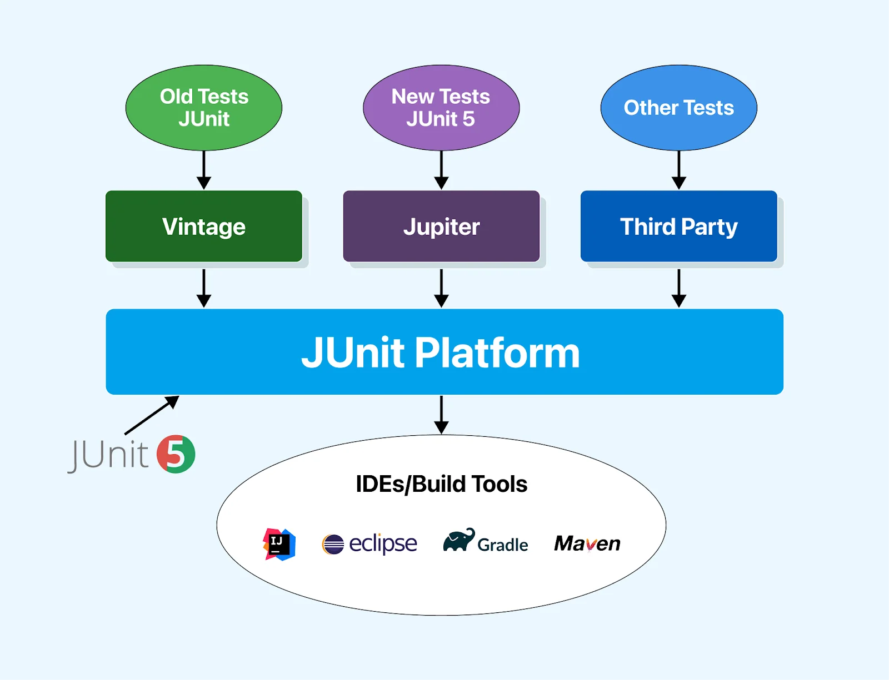

# ✏️JUnit
## 🛠️JUnit이란?
Java의 `단위 테스트`를 수행해주는 대표적인 Testing Framework이다.

<br>

## 🚀JUnit 5
JUnit5 = JUnit Platform + JUnit Jupiter + JUnit Vintage



### 🔹JUnit Platform
JUnit Platform은 Java Virtual Machine(JVM)에서 테스트 프레임워크를 실행하는 기반이다.
이 플랫폼은 TestEngine 인터페이스를 정의한다.

### 🔹JUnit Jupiter
JUnit Jupiter은 JUnit5에서 테스트 및 Extension을 작성하기 위한 새로운 프로그래밍 모델과 확장 모델의 조합이며, 
TestEngine API 구현체 입니다.

### 🔹JUnit Vintage
JUnit Vintage는 기존 JUnit 3 및 JUnit 4에서 작성된 테스트를 JUnit 5 플랫폼에서 실행할 수 있도록 지원해준다.
(하위 호환성)

<br>

## ⚖️ JUnit 4 vs JUnit 5

|     기능      |          JUnit 4           |                       JUnit 5                       |
|:-----------:|:--------------------------:|:---------------------------------------------------:|
|    아키텍처     |       단일 JAR 파일로 구성됨       |  JUnit Platform, JUnit Jupiter, JUnit Vintage로 구성됨  |
|  필수 JDK 버전  |         Java 5 이상          |                      Java 8 이상                      |
|     어설션     |   `org.junit.Assert` 사용    |          `org.junit.jupiter.Assertions` 사용          |
|     가정문     |   `org.junit.Assume` 사용    | `org.junit.jupiter.api.Assumptions` 사용 (축소된 메서드 제공) |
|  태깅 및 필터링   |     `@Category` 어노테이션      |                    `@Tag` 어노테이션                     |
|   테스트 스위트   | `@RunWith`, `@Suite` 어노테이션 | `@Suite`, `@SelectPackages`, `@SelectClasses` 어노테이션 |
| 비공개 테스트 메서드 |     반드시 `public` 이어야 함     |      `package-private` 가능, `public` 기본 생성자 불필요      |

<br>

## 🔖JUnit 5 주요 어노테이션
### 🔹@Test
- 해당 메서드가 테스트 메서드임을 나타냄.
- 메서드의 실행 순서를 보장하지 않는다.
- 별도의 속성을 가지지 않음.

<br>

## 📌JUnit Assertion
테스트가 원하는 결과를 제대로 리턴하는지 에러는 발생하지 않는지 확인할 때 사용하는 메소드 <br>

### 🔹fail
```public static <V> V fail(String message)```<br>
- Fails a test with the given failure message.
- 무조건 실패

### 🔹assertEquals(expected, actual)
```public static void assertEquals(short expected, short actual)``` <br>
- Asserts that expected and actual are equal.
- `expected`와 `actual`이 동일하면 `True`

```public static void assertEquals(double expected, double actual, double delta)```<br>
- Asserts that expected and actual are equal within the given delta.
- `delta` : 부동소수점(double) 비교 시 오차를 허용하기 위해서

<br>

## 📚참고 자료
- 🌐[JUnit Tutorial: An Inclusive Guide](https://www.lambdatest.com/learning-hub/junit-tutorial)
- 🌐[Velog: JUnit이란 무엇일까?](https://velog.io/@choidongkuen/Junit-%EC%9D%B4%EB%9E%80-%EB%AC%B4%EC%97%87%EC%9D%BC%EA%B9%8C-e0w6tlvp)
- 📜[Assertions API](https://junit.org/junit5/docs/5.0.1/api/org/junit/jupiter/api/Assertions.html)🔥🔥🔥
